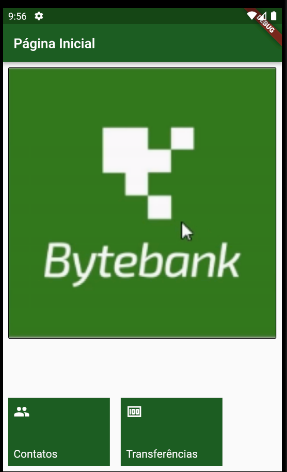

# Sobre o repositório

Este repositorio contém o bytebank do [curso do alura](https://cursos.alura.com.br/course/flutter-fundamentos) 




# Pré-Requisitos
Após instalar o Flutter, [baixe](https://developer.android.com/studio) e 
[instale](https://developer.android.com/studio/install) o Android Studio para
acessar o Android SDK e criar um emulador Android. 
[Instruções para criar um emulador](https://developer.android.com/studio/run/managing-avds#createavd)

# Criar um projeto no Flutter

```bash
# Verifica as configurações atuais do flutter
flutter doctor
# Cria o novo projeto
flutter create <nome_do_projeto>
# Rodar o projeto
cd <nome_do_projeto>
flutter run
```

Se receber uma mensagem de "No supported devices connected". Execute:

```bash
# Consulte os emuladores disponiveis
flutter emulator
# Vincule o emulador na execução
flutter emulator --launch Pixel_2_API_30
# Rode o projeto
flutter run
```
# Branches e Commits

### Branches

Deve se utilizar um padrão no gerenciamento de branches para facilitar o ciclo de
`desenvolvimento -> deploy do projeto` e facilitar que múltiplos desenvolvedores
possam trabalhar em conjunto numa mesma feature reduzindo os conflitos na base de código.

#### Nomenclatura Branches

Deve-se utilizar o seguinte padrão:

- Branch de feature: feat/<nome>
- Branch de bugfix: fix/<descrição>
- Branch de refatoração: refactor/<descrição>

### Commits

Deve se utilizar um padrão nas mensagens de commits para facilitar no processo de
revisão e na escrita de boas notas de versão(release notes).

#### Nomenclatura Commits

Deve-se utilizar o seguinte padrão:

- `feat`: para introdução de uma nova feature;
- `chore`: para alteração de algo que não impacte o usuário, alteração no procedimento
de build ou ferramentas auxiliares de desenvolvimento;
- `fix`: para correção de bugs;
- `refactor`: para um commit que não adiciona uma nova feature e nem corrige um bug;
- `test`: para adição de testes faltantes ou correção de testes existentes;
- `perf`: para alterações que visem a melhora de performance;
- `docs`: para alteração de documentação;
- `style`: para um commit que não altera comportamento de código, apenas estilo;
- `wip`: Caso seja necessario parar o que esta sendo desenvolvido para realizar uma 
correção, deve-se comitar com wip(work in progress)

Por exemplo:
> feat: added contribution date

A app to control applying

Author: Renan Ponick